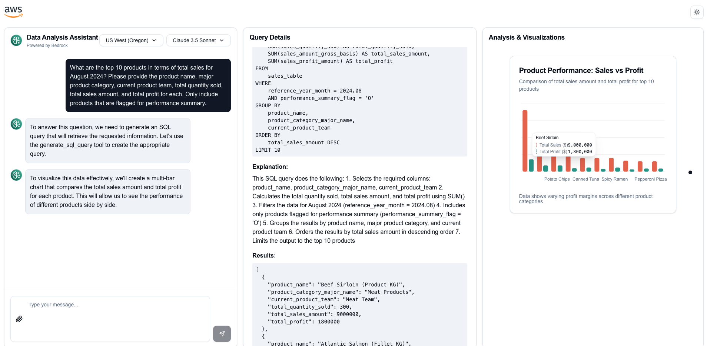

# Data Analyst Agent Bedrock



A sophisticated Next.js application that combines Bedrock's capabilities with Text-to-SQL & interactive data visualization to analyze data via chat.

## Features

- **Intelligent Data Analysis**: Powered by Bedrock
- **Interactive Data Exploration**: 
  - Database querying with Text-to-SQL (optimized for single table structure)
  - Schema JSON and sample data 
- **Multi-Format File Upload Support**:
  - Text/Code files (.txt, .md, .html, .py, .csv, etc)
  - PDF documents (Regular PDF with text, scanned documents not supported)
  - Image files for visual data analysis
- **Interactive Data Visualization**: Based on the context and data analyzed, Claude can generate the following charts:
  - Line Charts (Time series data & trends)
  - Bar Charts (Single metric comparisons)
  - Multi-Bar Charts (Multiple metrics comparison)
  - Area Charts (Volume/quantity over time)
  - Stacked Area Charts (Component breakdowns)
  - Pie Charts (Distribution analysis)

## Getting Started

### Prerequisites

- Node.js 18+ installed
- AWS Profile (Bedrock Model Access Enabled)

### Installation

1. Clone the repository:
   ```bash
   git clone https://github.com/kevmyung/data-analysit-agent-bedrock.git
   cd data-analysit-agent-bedrock
   ```

2. Configure AWS credentials:

   - Option 1: Set up a default AWS profile
      ```bash
      aws configure
      ```

   - Option 2: Create a `.env.local` file in the root directory:
      ```env
      BAWS_ACCESS_KEY_ID=your_api_key_here
      BAWS_SECRET_ACCESS_KEY=your_api_scret_key_here
      ```

3. Prepare your dataset:
   - Use `prepare_dataset.ipynb` to initialize the database
   - Update `db_schema.json` with your specific database schema
   - Replace `sample.db` with your actual database file or connection details


4. Install dependencies:
   ```bash
   cd data-analysit-agent
   npm install
   ```

   5. Run the development server:
   ```bash
   npm run dev
   ```
Access the application at [http://localhost:3000](http://localhost:3000).

## Technology Stack

- **Frontend**:
  - Next.js 14
  - React
  - TailwindCSS
  - Shadcn/ui Components
  - Recharts (For data visualization)
  - PDF.js (For PDF processing)

- **Backend**:
  - Next.js API Routes
  - Edge Runtime
  - AWS SDK

## Usage Examples

The assistant can help with various financial analysis tasks:

1. Data Analysis: Extract insights from documents and databases

2. Visualization: Create custom charts based on data

3. Interactive Querying: Use natural language to explore databases

4. AI-Assisted Insights: Get explanations and trends through chat

